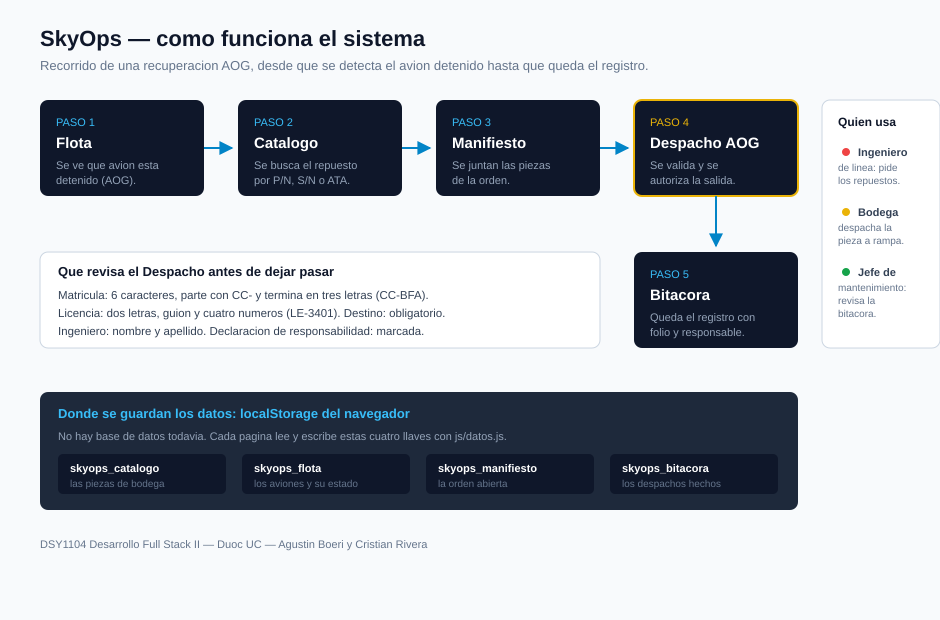

# SkyOps

Sitio web del proyecto **SkyOps**, un sistema de logistica y recuperacion **AOG**
(*Aircraft On Ground*). Cuando un avion queda detenido en tierra por una falla, la
plataforma permite buscar el repuesto, armar el manifiesto y autorizar el despacho
hacia la puerta o el hangar donde esta la aeronave.

- **Ramo:** DSY1104 — Desarrollo Full Stack II
- **Carrera:** Ingenieria en Informatica, Duoc UC
- **Evaluacion:** Parcial 1
- **Integrantes:** Agustin Boeri y Cristian Rivera

---

## 1. Como funciona el sistema



El recorrido completo es este:

| Paso | Pagina | Que pasa |
|---|---|---|
| 1 | `flota.html` | Se ve que avion esta declarado AOG y en que puerta esta. |
| 2 | `catalogo.html` | Se busca el repuesto por nombre, P/N, S/N o capitulo ATA. |
| 3 | `manifiesto.html` | Se juntan las piezas de la orden y se ajustan cantidades. |
| 4 | `despacho.html` | Se validan los datos y se autoriza la salida. Se genera un folio. |
| 5 | `bitacora.html` | Queda el registro con folio, responsable, destino y tiempo. |

Las otras tres paginas son de apoyo: `index.html` (portada y resumen),
`proyecto.html` (de que se trata) y `contacto.html` (soporte).

---

## 2. Como abrirlo

1. Clonar el repositorio.
2. Abrir la carpeta en IntelliJ IDEA: **File > Open**.
3. Abrir `index.html`, clic derecho > **Open in Browser**.

No hay que instalar nada, ni compilar, ni levantar un servidor.

---

## 3. Como se comunican las paginas entre si

Las paginas son archivos HTML separados, asi que **no comparten variables**. Cuando
cambias de pagina, todo el JavaScript se vuelve a cargar desde cero y las variables
se pierden.

Para que la informacion sobreviva usamos **`localStorage`**, que es una caja donde
el navegador guarda texto y no se borra al cambiar de pagina ni al cerrar el
navegador. Todo eso vive en `js/datos.js`, que se carga en todas las paginas.

Hay cuatro llaves:

| Llave | Que guarda | Quien la escribe |
|---|---|---|
| `skyops_catalogo` | las piezas de bodega | `catalogo.js` (al eliminar) |
| `skyops_flota` | los aviones y su estado | solo se lee |
| `skyops_manifiesto` | la orden que se esta armando | `catalogo.js`, `manifiesto.js` |
| `skyops_bitacora` | los despachos ya hechos | `despacho.js`, `bitacora.js` |

Como `localStorage` solo guarda texto, hay que traducir:

```javascript
guardarStorage('skyops_manifiesto', manifiesto);   // JSON.stringify: arreglo -> texto
let m = obtenerStorage('skyops_manifiesto');       // JSON.parse: texto -> arreglo
```

Hay un caso aparte: **`sessionStorage`**. Cuando en Flota aprietas "Abrir manifiesto",
la matricula se guarda ahi y el catalogo la lee para mostrar el aviso amarillo. Se usa
`sessionStorage` y no `localStorage` porque ese dato solo interesa mientras dure la
visita, no para siempre.

### Version de los datos

`js/datos.js` tiene una constante `VERSION_DATOS`. Si el navegador tiene guardada una
version anterior, se borran `skyops_catalogo` y `skyops_flota` y se vuelven a cargar
los datos nuevos. La bitacora y el manifiesto **no** se tocan porque son del usuario.

Sin esto pasaba un problema real: cambiabamos los datos en `datos.js` pero el
navegador seguia usando los viejos porque ya los tenia guardados.

---

## 4. Como se validan los datos

> **Importante:** en esta entrega **no hay login ni usuarios**. No se valida quien
> entra al sistema. La autenticacion y los permisos por rol corresponden a la
> Evaluacion Parcial 3. Lo que si se valida son los **datos que se escriben en los
> formularios**.

Los dos formularios validados son **Despacho AOG** (`js/despacho.js`) y
**Contacto** (`js/contacto.js`). Los dos usan la misma idea:

1. El `<form>` lleva el atributo **`novalidate`**. Eso apaga los mensajes automaticos
   del navegador, que salen en ingles o en el idioma del sistema y no se pueden
   cambiar. Asi ponemos los nuestros, en espanol y explicando que hacer.
2. **Cada campo tiene su propia funcion** (`validarMatricula`, `validarLicencia`...).
   Devuelve `true` si el dato esta bien y `false` si esta mal.
3. Si esta mal, el mensaje se escribe en un `<span>` que esta **debajo de ese campo**,
   no en una ventana aparte:

```html
<label class="label-form" for="despacho-matricula">Matricula de la Aeronave *</label>
<input type="text" id="despacho-matricula" list="lista-matriculas">
<span class="error-campo" id="error-matricula"></span>
```

```javascript
function mostrarError(idCampo, mensaje) {
    const span = document.getElementById('error-' + idCampo);
    span.textContent = mensaje;
    span.parentNode.classList.add('campo-con-error');   // pinta el borde de rojo
}
```

4. Se valida al **salir del campo** (`blur`), no solo al apretar el boton, para que la
   persona se de cuenta al tiro.
5. Al enviar se revisan **todos** los campos, no solo hasta el primer error, para que
   vea de una vez todo lo que le falta.

### Que revisa cada campo

| Campo | Regla | Mensaje si falla |
|---|---|---|
| Matricula | 6 caracteres, parte con `CC-`, termina en 3 letras | *"La matricula tiene 6 caracteres. Escribiste 5."* |
| Destino | tiene que elegir una opcion | *"Elige la puerta o el hangar donde esta la aeronave."* |
| Ingeniero | minimo 5 letras y tiene que traer un espacio | *"Falta el apellido. Ejemplo: Agustin Boeri."* |
| Licencia | 2 letras + guion + 4 numeros | *"Despues del guion van cuatro numeros."* |
| Declaracion | tiene que estar marcada | *"Debes declarar que la informacion es correcta."* |

La validacion **no usa expresiones regulares** a proposito. Usa `.length`,
`.charAt()`, `.substring()` y dos funciones propias, `esLetra()` y `esNumero()`:

```javascript
function esLetra(caracter) {
    const letras = 'ABCDEFGHIJKLMNOPQRSTUVWXYZ';
    return letras.indexOf(caracter.toUpperCase()) !== -1;
}
```

### Sugerencias y autocompletado

La matricula usa un **`<datalist>`**: al escribir aparecen las matriculas de la flota.
Es HTML puro, no necesita JavaScript. El aeropuerto en Contacto funciona igual.

### Reglas de negocio (no son de formato)

- No se puede pedir mas unidades de las que hay en bodega: el manifiesto ajusta la
  cantidad al stock y avisa por que.
- Una linea con cantidad 0 se elimina sola.
- No se puede autorizar un despacho con el manifiesto vacio: te manda al catalogo.

---

## 5. Como cambiar los colores

**Todos** los colores del sitio salen del bloque `:root` que esta al principio de
`css/estilos.css`. En el resto del CSS no hay ni un color escrito a mano: todos usan
`var(--nombre)`.

```css
:root {
    --acento: #0284c7;      /* azul principal: botones y menu activo */
    --celeste: #38bdf8;     /* azul claro: titulos y datos destacados */
    --primario: #0f172a;    /* azul muy oscuro: cabecera y paneles */
    --peligro: #ef4444;     /* errores y boton de eliminar */
    ...
}
```

Si cambias `--acento` de azul a naranjo, cambian de una sola vez los botones, el
enlace activo del menu y los detalles de todas las paginas. No hay que buscar y
reemplazar en 8 archivos.

Los colores estan agrupados por para que sirven: marca, fondos, textos, bordes,
estados e insignias.

---

## 6. Donde esta cada clase

El CSS esta partido en dos archivos por responsabilidad:

- **`css/estilos.css`** — la paleta, la estructura general (cabecera, menu, contenedor,
  pie), las tarjetas, las tablas y las clases de cada pagina.
- **`css/formularios.css`** — todo lo que tiene que ver con campos, botones, filtros y
  las tablas oscuras de los paneles.

Las clases mas usadas:

| Clase | Que hace | Donde se ve |
|---|---|---|
| `.contenedor` | centra el contenido y le pone el ancho maximo | todas las paginas |
| `.contenedor-ancho` | lo estira a 1200px | catalogo, manifiesto, bitacora |
| `.encabezado-pagina` | el titulo con su bajada | todas |
| `.seccion-oscura` | el panel azul oscuro con sombra | despacho, bitacora, flota |
| `.tarjeta-componente` | la ficha de cada repuesto | catalogo |
| `.linea-manifiesto` | cada fila de la orden | manifiesto |
| `.tabla-despacho` | las tablas oscuras | despacho, bitacora, flota |
| `.tabla-scroll` | deja que la tabla se desplace sola en celular | todas las tablas |
| `.label-form` | la etiqueta gris sobre cada campo | formularios |
| `.error-campo` | el mensaje rojo bajo el campo | despacho, contacto |
| `.campo-con-error` | pinta el borde del campo de rojo | despacho, contacto |
| `.badge-completado` / `.badge-encurso` | el estado en la bitacora | bitacora |
| `.badge-aog` / `.badge-operativa` | el estado del avion | flota |

**No hay ni un `style="..."` en el HTML ni en el JavaScript.** Todo el diseno esta en
los dos archivos CSS, que se enlazan de forma externa:

```html
<link rel="stylesheet" href="css/estilos.css">
<link rel="stylesheet" href="css/formularios.css">
```

---

## 7. Como se adapta a celular y tablet

El sitio esta pensado para escritorio y se adapta hacia abajo con **media queries**.
Hay tres cortes:

| Corte | Para que | Que cambia |
|---|---|---|
| `1024px` | tablet horizontal (iPad) | las columnas dobles pasan a una; los filtros a 2 columnas |
| `768px` | tablet vertical y celular grande | el logo va arriba y el menu abajo centrado; las fichas en 1 columna |
| `480px` | celular | los indicadores se apilan; se achican los textos del menu |

Las tablas no se achican: van dentro de un `.tabla-scroll` y se desplazan solas hacia
el lado, que es mas legible que apretar las columnas.

### Un detalle importante de la cascada

Las media queries de selectores que se definen en `formularios.css` **tienen que estar
en ese archivo**. Como `formularios.css` se enlaza despues de `estilos.css`, sus reglas
base le ganan a cualquier media query que este en `estilos.css`. Nos paso: el catalogo
seguia desbordando en tablet hasta que movimos esas reglas al archivo correcto.

---

## 8. Decisiones de diseno

**Por que ocho paginas separadas y no una sola.** La rubrica pide navegacion por
hipervinculos entre paginas. Ademas cada pagina es un paso del flujo y se entiende
sola.

**Por que `localStorage` y no una base de datos.** Esta entrega es solo front-end. La
base de datos y los servicios REST son de la Evaluacion Parcial 3. `localStorage` nos
deja simular la persistencia sin backend.

**Por que dos archivos CSS y no uno.** Separar por responsabilidad: la estructura del
sitio por un lado y los formularios por otro. Un archivo de 400 lineas es mas dificil
de mantener entre dos personas que dos de 200.

**Por que variables CSS.** Para poder cambiar el tema completo desde un solo lugar,
sin buscar y reemplazar colores en todo el proyecto.

**Por que un archivo JavaScript por pagina.** `catalogo.js` solo se preocupa del
catalogo, `despacho.js` solo del despacho. Si algo falla, se sabe donde mirar. Lo
compartido (los datos y el `localStorage`) esta en `js/datos.js`.

**Por que `novalidate` en los formularios.** Para escribir nuestros propios mensajes,
en espanol y explicando como arreglarlo, en vez de los del navegador.

**Por que las imagenes estan en el proyecto y no enlazadas de internet.** Antes venian
de Unsplash y no cargaban sin conexion. Ahora estan en `assets/img/` y el sitio
funciona igual sin internet.

**Por que la validacion sin expresiones regulares.** Son mas cortas, pero para
explicarlas hay que entender una sintaxis aparte. Con `.length` y `.charAt()` el
codigo se lee igual que se cuenta en voz alta.

---

## 9. Estructura de archivos

```
SkyOpsV2/
├── index.html          portada con el resumen
├── proyecto.html       de que se trata el proyecto
├── catalogo.html       catalogo de componentes con filtros
├── manifiesto.html     la orden de trabajo
├── despacho.html       formulario de autorizacion
├── bitacora.html       historial de despachos
├── flota.html          aviones y su estado
├── contacto.html       formulario de soporte
│
├── css/
│   ├── estilos.css     paleta, estructura, tarjetas, tablas
│   └── formularios.css campos, botones, filtros, validacion
│
├── js/
│   ├── datos.js        datos de ejemplo y acceso a localStorage
│   ├── principal.js    contadores de la portada
│   ├── catalogo.js     dibujar y filtrar el catalogo
│   ├── manifiesto.js   editar la orden
│   ├── despacho.js     validacion y autorizacion
│   ├── bitacora.js     historial y resolver AOG
│   ├── flota.js        listado de aviones
│   └── contacto.js     validacion del soporte
│
├── assets/img/         imagenes de los componentes
└── docs/               diagrama del sistema
```

---

## 10. Lo que queda para las proximas entregas

| Hito | Que se agrega |
|---|---|
| **Parcial 2** | Migracion a un framework y pruebas unitarias con Jasmine y Karma |
| **Parcial 3** | Backend con Spring Boot, base de datos real, **login y permisos por rol** |

Tambien queda pendiente que el stock baje al agregar una pieza al manifiesto: hoy el
manifiesto respeta el maximo de bodega, pero el numero del catalogo no cambia.
